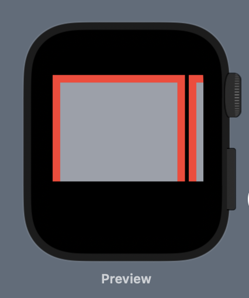
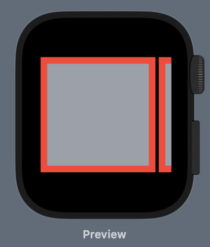

# SwiftUIWatchOSScrollViewBug

When using a ScrollView configured to perform horizontal scrolling, using the initializer `ScrollView([.horizontal])`, the scroll view's content is incorrectly sized and cuts off the bottom of the content, behaving as though horizontal and vertical scrolling were requested with a content view height smaller than the height of the scroll view's content views.

Steps to reproduce:

 - Open the project referenced above, and use the Canvas to preview `ContentView`. ContentView contains a ScrollView, containing an HStack, containing three Rectangles, styled to display a red border. The HStack has a modifier to constrain to a frame of the exact width and height of three such Rectangles with appropriate spacing.
 - Observe that the bottom of the rectangles is cut off (the bottom borders are not visible). When running the preview live, observe that the scrollview may be scrolled vertically to see the bottoms of the rectangles.
 - Change the initializer of the ScrollView to include [.horizontal, .vertical] and observe that the rectangles are no longer cut off. When running the preview live, the scrollview bounces vertically.

